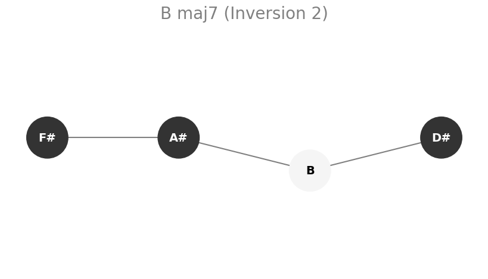

# Chord Diagram Generator

This Python script generates visual diagrams of musical chords based on specified root notes, chord types, and inversions—or from a custom list of chord names. Output diagrams can be saved as a single multi-page PDF or as individual image files (PNG or JPG).



---

## Features

- **Flexible Input Options**:
  - Generate diagrams using combinations of root notes, chord types, and inversions (e.g., all major and minor chords for C, F, G).
  - Use a specific list of chord names, including slash notation (e.g., `Cmaj7`, `G7/B`, `Am`, `Fsus4`).

- **Comprehensive Chord Vocabulary**:
  - Supported chord types include:
    - Major, Minor, Augmented, Diminished triads
    - Dominant 7th, Major 7th, Minor 7th, Diminished 7th, Half-diminished 7th (`m7b5`)
    - Major 6th, Minor 6th
    - Major 9th, Dominant 9th, Minor 9th
    - Suspended 2nd, Suspended 4th
  - Parses common aliases (e.g., `m`, `min`, `M`, `maj`, `dom7`, `o`, `+`, `sus`, `ø`).

- **Automatic Inversion Handling**:
  - Calculates inversions (0 for root, 1 for first, etc.).
  - Slash chords (e.g., `C/E`) are parsed and mapped to correct inversions.

- **Multiple Output Formats**:
  - `pdf`: Multi-page file with all diagrams.
  - `png` / `jpg`: Individual image files per chord in a named subdirectory.

- **Customizable Output Location**:
  - Choose base directory for saving results.

- **Visual Clarity**:
  - Distinguishes white and black keys.
  - Note labels are clear.
  - Diagram width adapts to chord complexity.

---

## Installation

### 1. Clone the Repository or Download Files

```bash
git clone <your-repo-url>
cd <repository-directory>
```

### 2. Install System Dependency: Graphviz

While Matplotlib handles rendering, `networkx` benefits from Graphviz for layout.

- **macOS (Homebrew):**
  ```bash
  brew install graphviz
  ```
- **Linux (Debian/Ubuntu):**
  ```bash
  sudo apt-get update
  sudo apt-get install graphviz libgraphviz-dev pkg-config
  ```
- **Windows:**  
  Download from the [Graphviz site](https://graphviz.org/download/) and add its `bin` directory to your system's PATH.

### 3. Install Python Dependencies

Using a virtual environment is recommended.

```bash
python -m venv venv
# Activate: (use venv\Scripts\activate on Windows)
source venv/bin/activate
pip install -r requirements.txt
```

Your `requirements.txt` should include:

```
matplotlib
networkx
```

---

## Usage

Run the script from the command line. You **must choose one input mode**:

### Mode 1: Specific Chords

```bash
python chord_generator.py -c Cmaj7 G7/B Am [OPTIONS]
```

### Mode 2: Combinatorial Generation

```bash
python chord_generator.py -r C F -t m7 -i 0 1 [OPTIONS]
```

If no mode is specified, it will fall back to a default set.

---

## Options

- `-c`, `--chords`: List of chord names (e.g., `Am`, `C/E`).
- `-r`, `--roots`: List of root notes (e.g., `C D E F#`).
- `-t`, `--types`: List of chord types (e.g., `maj`, `m7`, `sus4`).
- `-i`, `--inversions`: List of inversions to include (0 = root, 1 = first, ...).
- `--skip-root`: Excludes root position when generating inversions.
- `--format <pdf|png|jpg>`: Output format (default = `pdf`).
- `--output-dir <path>`: Base directory for output (default = `./chord_graphs`).
- `-h`, `--help`: Show help and exit.

---

## Examples

**1. Default combination as PDF:**

```bash
python chord_generator.py
```

_Output: `./chord_graphs/Roots_All_Types_All_Invs_Default.pdf`_

**2. Specific chords as PNGs:**

```bash
python chord_generator.py -c Cmaj7 G7/B Am --format png
```

_Output: Individual PNGs in `./chord_graphs/CustomChords-Cmaj7-G7_B-Am/`_

**3. Minor 7th chords for C and F (root & 1st inversion) as JPGs:**

```bash
python chord_generator.py -r C F -t m7 -i 0 1 --format jpg --output-dir ./output_images
```

**4. PDF output for Fsus4 and Caug:**

```bash
python chord_generator.py -c Fsus4 Caug --format pdf --output-dir .
```

---
